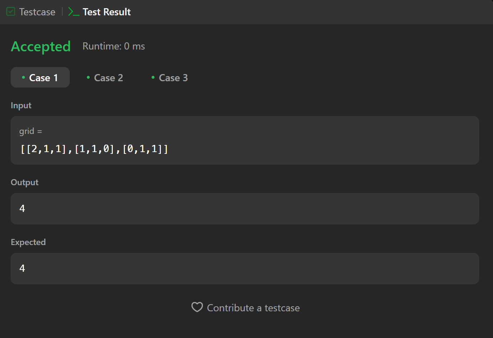

## Bài làm số 5
```cpp
class Solution {
public:
    int orangesRotting(vector<vector<int>>& grid) {
        int m = grid.size();
    int n = grid[0].size();
    int fresh = 0;
    vector<pair<int, int>> rotten;
    for (int i = 0; i < m; i++) {
        for (int j = 0; j < n; j++) {
            if (grid[i][j] == 1) {
                fresh++;
            } else if (grid[i][j] == 2) {
                rotten.push_back({i, j});
            }
        }
    }
    int minutes = 0;
    while (fresh > 0 && !rotten.empty()) {
        vector<pair<int, int>> new_rotten;
        for (auto& p : rotten) {
            int i = p.first;
            int j = p.second;
            if (i > 0 && grid[i - 1][j] == 1) {
                grid[i - 1][j] = 2;
                fresh--;
                new_rotten.push_back({i - 1, j});
            }
            if (i < m - 1 && grid[i + 1][j] == 1) {
                grid[i + 1][j] = 2;
                fresh--;
                new_rotten.push_back({i + 1, j});
            }
            if (j > 0 && grid[i][j - 1] == 1) {
                grid[i][j - 1] = 2;
                fresh--;
                new_rotten.push_back({i, j - 1});
            }
            if (j < n - 1 && grid[i][j + 1] == 1) {
                grid[i][j + 1] = 2;
                fresh--;
                new_rotten.push_back({i, j + 1});
            }
        }
        rotten = new_rotten;
        minutes++;
    }
    return fresh == 0 ? minutes : -1;
    }
};
```
## Kết quả test
